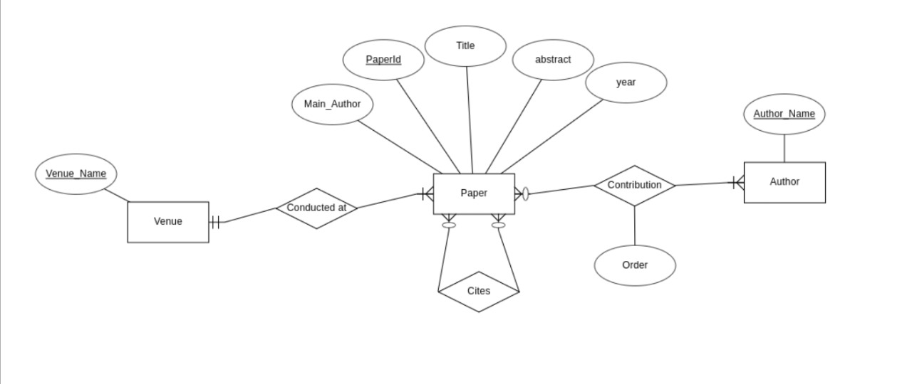

# DBMS_Group_Project
 
### This repo contains the source code for parser and SQL files done as a part of CS3563 Group Project

## Created a Relational Database from raw-data

* Here is the <U><B>E-R diagram</B></U> we have used

* `Parsed the data and loaded the tables` with corresponding information.

* Executed `SQL` Queries on the database to retrieve relevant information
